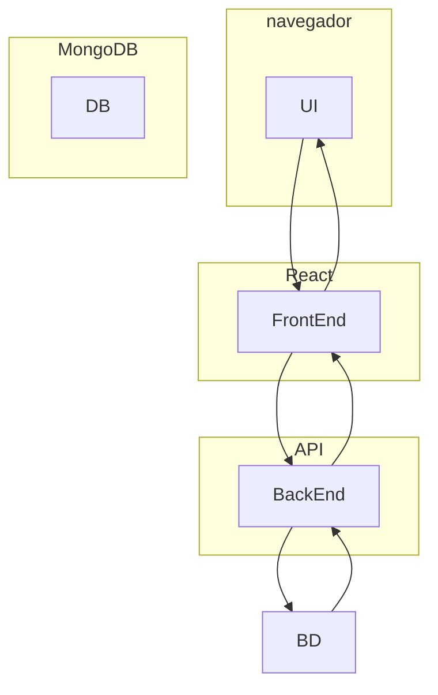

## maipulação de mongodb

## Criando um Diagrama com Mermaid

### Diagrama de Fluxo de Arquitetura de Projeto

```mermaid 
graph TD
    subgraph Cliente["navegador"]
        UI
    end

    subgraph Front["React"]
        FrontEnd
    end

    subgraph Back["API"]
        BackEnd
    end

    subgraph Banco["MongoDB"]
        DB
    end

    %% fluxo

    UI-->FrontEnd
    FrontEnd-->BackEnd
    BackEnd-->BD
    BD-->BackEnd
    BackEnd-->FrontEnd
    FrontEnd-->UI
    
```